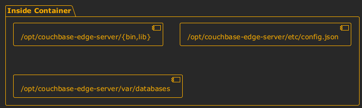

This README will guide you through running Couchbase Edge Server with Docker Containers.

[Edge Server](#) is a lightweight self contained alternative to Sync Gateway that securely manages the synchronization of data between [Couchbase Lite](https://www.couchbase.com/products/lite), other Edge Server deployments and [Sync Gateway](https://www.couchbase.com/products/sync-gateway).  It is designed to run in environments where a full cloud deployment is not optimal.

For configuration references, or additional information about anything described below, visit the [Edge Server documentation site](#).

For additional questions and feedback, please visit the [Couchbase Forums](https://forums.couchbase.com/c/mobile/edge-server).

# QuickStart with Edge Server and Docker

## Running Edge Server with Docker

```
$ docker run -d --name edge-server -p 59840:59840 couchbase/edge-server
```

At this point you should be able to send an HTTP request to the Edge Server on port 59840 using curl:

```
$ curl http://localhost:59840
{"couchdb":"Welcome","vendor":{"name":"Couchbase Edge Server","version":"1.0.0 (26; )"},"version":"CouchbaseEdgeServer/1.0.0 (26; ) CouchbaseLiteCore/0.0.0-EE (770a516a19d505b7+219a0c1909febc53)"}
```

This setup is minimal and launches with an empty database that you are free to write to.  Some key container paths are noted in the following diagram:



Under the `/opt/couchbase-edge-server` root, the bin and lib directories contain the necessary executable data to run the server, `etc/config.json` is the configuration file that was used at startup, and `var/databases` stores the resulting database specified by the configuration.

## Viewing Logs
You can view the Edge Server logs via the `docker logs` command:

```
$ docker logs edge-server
2025-01-24T01:59:00.276Z        Using server TLS certificate: CN=127.0.0.1
2025-01-24T01:59:00.277Z        Starting Couchbase Edge Server 0.0.0 ()
2025-01-24T01:59:00.339Z        Sharing database https://localhost:59840/db/ from file /opt/couchbase-edge-server/var/databases/example.cblite2
etc ...
```

# Customizing Edge Server configuration

## Using a Docker volume

The default configuration is useful for trying out the server, but a production deployment is going to be a little more involved in its creation.  A production deployment should contain persistent files that are outside of the container, as shown in the following diagram:


**Step - 1 :** Prepare a local working directory somewhere on your machine.  These steps will refer to your working directory as `$LOCALPATH`.  Inside this directory, create two folders called `etc` and `databases`.

> [!CAUTION]
> Read/write permissions on files using docker volume mounts can get tricky.  By default, all mounted files and folders in the `/opt/couchbase-edge-server` directory must be accessible by either UID 1000 or GID 1000.  **This needs to be accounted for in `$LOCALPATH`**.  Please see [Notes on File and Folder Permissions](#Notes-on-File-and-Folder-Permissions) for more information.

**Step - 2 :** Start the docker container in interactive mode with the previously created `etc` directory mounted.  This is accomplished by setting the entry point of the container to `bash`. 

```
docker run -it --rm --entrypoint=bash -v $LOCALPATH/etc:/opt/couchbase-edge-server/etc couchbase/edge-server
```

**Step - 3 :** Create a TLS key and certificate for use with the server.  Normally, this would be done through your provider and the instructions are out of scope for this README, but for testing and tutorial purposes the edge server can create a self signed certificate for you.  The following command will create a cert and key file in the mounted `etc` directory (the default working directory of the container):

```
couchbase-edge-server --create-cert $HOSTNAME cert.pem key.pem
```

`$HOSTNAME` here is is hostname of the machine you plan to run it on, and it will be recorded in the `CN` of the resulting certificate. 

> [!IMPORTANT]  
> key.pem contains sensitive private key information inside of it and should be kept guarded.  Preferably it should have `600` permissions.

**Step - 4 :** While still in the container, create a user for the server so that HTTP auth can be used.  This will create a user named "alice":

```
couchbase-edge-server --add-user --create users.json alice
```

This will prompt you twice for a password.  Pick whatever you like, I will refer to it as `$PASSWORD`.

**Step - 5 :** After exiting the container, now it is time to write a config.json into the `$LOCALPATH/etc` folder that will use the items that were just created.  Create a config.json file with the following content:

```json
{
    "$schema": "https://packages.couchbase.com/couchbase-edge-server/config_schema.json",
    "https": {
        "tls_cert_path": "/opt/couchbase-edge-server/etc/cert.pem",
        "tls_key_path": "/opt/couchbase-edge-server/etc/key.pem"
    },
    "users": "/opt/couchbase-edge-server/etc/users.json",
    "databases": {
        "db": {
            "path":  "/opt/couchbase-edge-server/var/databases/example.cblite2",
            "create": true,                   
            "enable_client_writes": true,
            "enable_client_sync": true
        }
    }
}
```

**Step - 6 :** Now all that's left to do is to start the container in server mode with both the `etc` and `databases` directories mounted.

```
docker run -d -p 59840:59840 -v $LOCALPATH/etc:/opt/couchbase-edge-server/etc -v $LOCALPATH/databases:/opt/couchbase-edge-server/var/databases couchbase/edge-server
```

Once started, you will notice that your `$LOCALPATH/databases` folder now has a database called `example.cblite2` inside of it, due to the `create: true` portion of the config.  Accordingly, if you have pre-existing databases that you want to use, you can include them in this folder and add the appropriate section to the `databases` section of the config.

You'll also notice that now in order to access the REST API you will need to use HTTP basic auth as user `alice` with password `$PASSWORD`.  If you were to use a real TLS certificate instead, along with users applicable to your use case, then this would be a production deployment.

> [!IMPORTANT]  
> Now that the server is running, any changes to any of the configuration files or certificates will not take effect unless the server is restarted.

## Notes on File and Folder Permissions

This section only applies to Unix based hosts of Docker.  If you are running Docker on Windows you can ignore it.

All entries mounted in `etc` need to be readable be either UID 1000 or GID 1000, and all entries mounted in `var/databases` need to be readable *and* writable by either UID 1000 or GID 1000.  You can check your UID and any GID that you are a part of by running the `id` command.  

If your UID is not 1000 and 1000 is not in your GID list, then you can change the default UID and/or GID that docker runs with by using the `--user`.  You can pass in just a custom UID with `--user $uid` or both a custom UID and GID with `--user $uid:$gid`.  The recommended course of action is to use a custom GID, so you can pick one of the GID entries from the result of your `id` output and pass it in with the UID 1000:  `--user 1000:$gid` where `$gid` is the aforementioned entry from your GID list.  After that, ensure that your local `etc` directory has at least `755` permissions, and your local `databases` directory has at least `775` permissions.